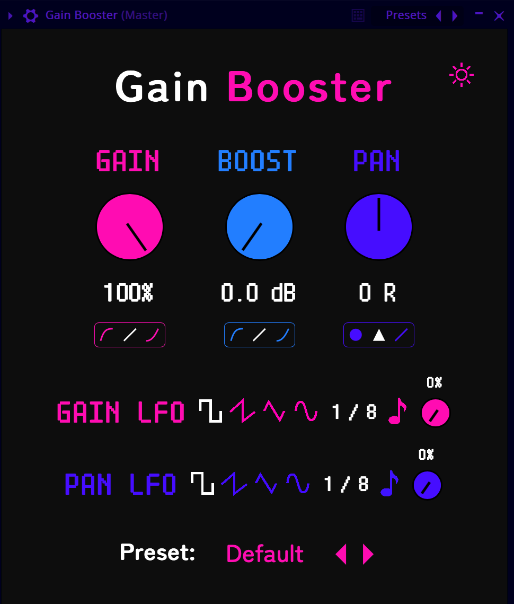

# Gain Booster

Gain Booster is a VST/AU plugin for gain control, panning, and quick LFO modulation.

### Controls:
- Gain - the knob controls the volume from 0% to 100%.
- Gain curve - you can choose a logarithmic, linear, or exponential curve for the gain knob.
- Boost - with the boost knob, you can increase the original volume by up to 12 dB.
- Boost curve - you can choose a logarithmic, linear, or exponential curve for the boost knob.
- Pan - this controls the volume of the left and right channels individually for a stereo effect.
- Panning Law - changes the panning law algorithm between constant power, triangular, and linear.
- Gain LFO Waveform - pick from square, sawtooth, triangle, and sine shapes for the gain LFO. 
- Gain LFO Rate - the speed of the gain LFO in bpm synced times.
- Gain LFO Amount - the amount of the gain LFO effect applied.
- Pan LFO Waveform - pick from square, sawtooth, triangle, and sine shapes for the panning LFO. 
- Pan LFO Rate - the speed of the panning LFO in bpm synced times.
- Pan LFO Amount - the amount of the panning LFO effect applied.

That should be it!

### Installation

Download from the [releases](https://github.com/Moebits/Gain-Booster/releases) tab and rescan the plugins in your DAW.

### Windows

On Windows you need to install the WebView2 runtime, because the default WebView will probably be too old. 
https://developer.microsoft.com/en-us/Microsoft-edge/webview2/

### Building

Release build - `npm install` and `npm run build` should take care of it. 

Debug build - I run the project with the VSCode debugger and use `npm start` to start the frontend 
server. You must install the AudioPluginHost from JUCE and put it in your applications folder. 

### Credits

- [JUCE](https://juce.com/)
